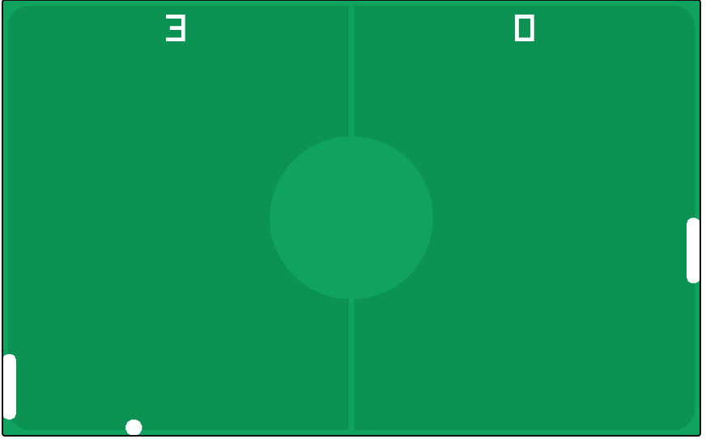

# 🎮 GameWeb – C++ & Raylib Web Game Collection

**GameWeb** is a modern, bento-grid styled web platform that showcases games built using **C++ (Raylib)** compiled into **WebAssembly** (WASM), allowing them to run smoothly in the browser. The site is also designed to host future games built with **Java** or powered by **AI**.

---

## 🚀 Live Demo

🌐 [Play Now](https://your-live-site-url.com)

---

## 🧩 Home UI Features

- 🖼️ Bento-style game preview layout  
- 🧠 Minimal and modern design using Tailwind CSS  
- ⚡ Fast load times with iframe-embedded WASM games  
- 📱 Fully responsive – mobile & desktop friendly

---

## 🕹️ Featured Games

### 🏓 Ping Pong
  
Classic Pong game built with C++ & Raylib. First to 11 wins unless both hit 10 – then tiebreaker to 5 starts!

### 🏃 Introvert Run 0.1
  
A side-scrolling runner where you avoid obstacles.

---

## 🔧 Tech Stack

| Area                | Stack                             |
|---------------------|-----------------------------------|
| Game Engine         | C++ + Raylib                      |
| Web Compilation     | Emscripten → WebAssembly (WASM)   |
| Frontend Framework  | React                             |
| Styling             | Tailwind CSS                      |
| Routing             | React Router DOM                  |
| Hosting             | GitHub Pages / Vercel             |

---

## ⚙️ How Games Are Embedded

1. **Build your game** in C++ using Raylib.
2. **Compile to WebAssembly** with Emscripten:
   ```bash
   emcc main.cpp -o index.html -O2 \
     -s USE_GLFW=3 -s ASYNCIFY \
     -s ALLOW_MEMORY_GROWTH=1 -s FULL_ES3=1
   ```
3. Place the output folder (HTML + WASM) inside `public/game-name/`
4. Use an `<iframe>` in React:
   ```jsx
   <iframe src="/game-name/index.html" className="w-full h-full rounded-xl" />
   ```

---

## 🗂 Folder Structure

```
GameHub/
├── public/
│   ├── ping-pong/
│   ├── introvert-run/
│   └── screenshots/
├── src/
│   ├── components/
│   ├── pages/
│   └── App.jsx
├── tailwind.config.js
├── package.json
└── README.md
```

---

## 🌱 Future Plans

- [ ] Add Java-based games compiled for web (TeaVM, LibGDX)
- [ ] Integrate AI-powered characters / decision-making
- [ ] Game state saving using localStorage
- [ ] Online leaderboard system
- [ ] Mobile-friendly touch support
- [ ] Gamepad / controller support

---

## 👤 Author

**Md Salman Talukder**  
🧑‍🎓 Computer Engineering Student  
🛠 Passionate about Game Development, AI & Web  
🔗 [GitHub: @MdSalmanTd](https://github.com/MdSalmanTd)

---

## 📄 License

This project is open-source and free to use. Attribution is appreciated but not required.
